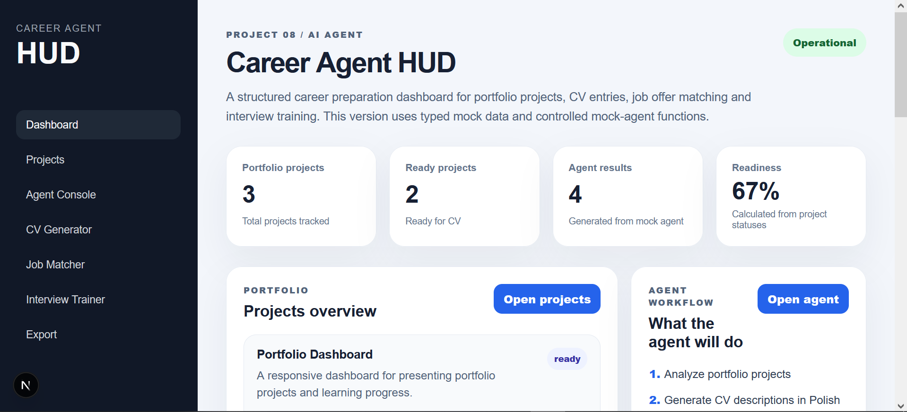
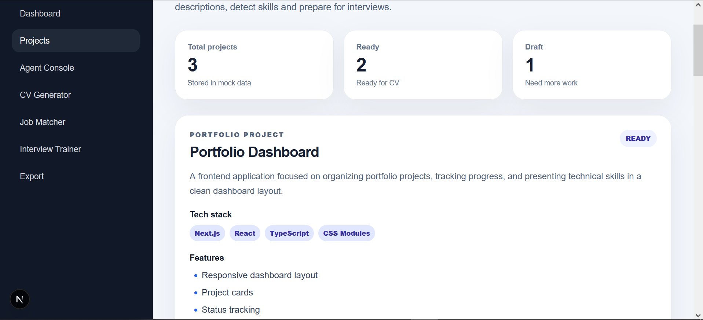
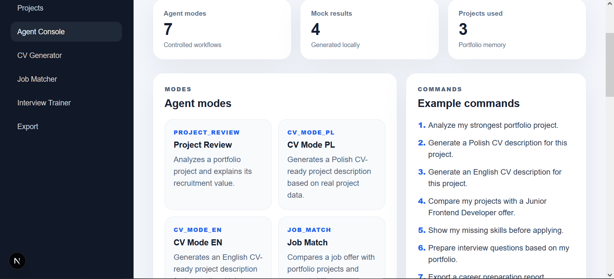
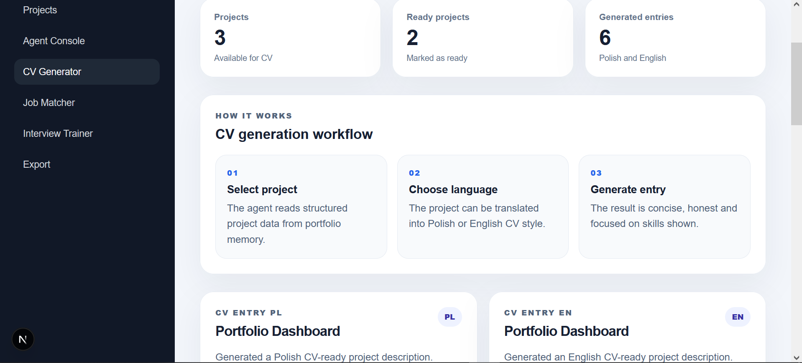
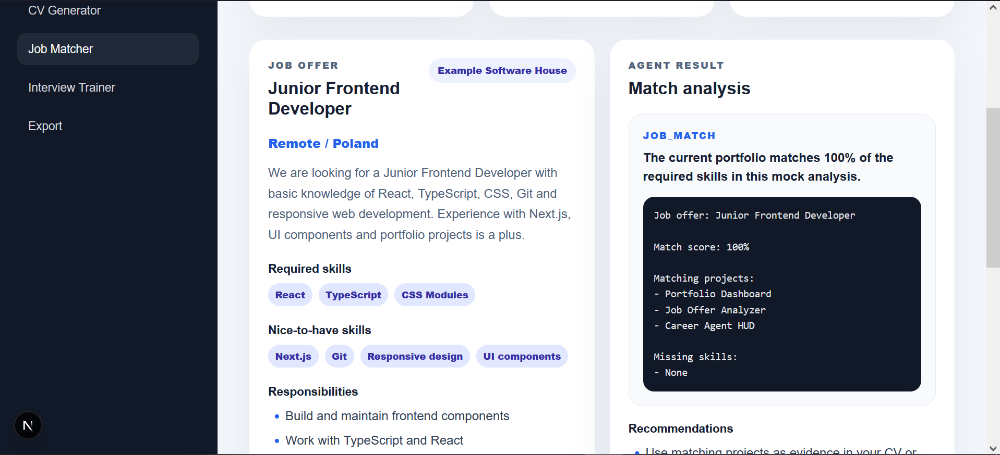
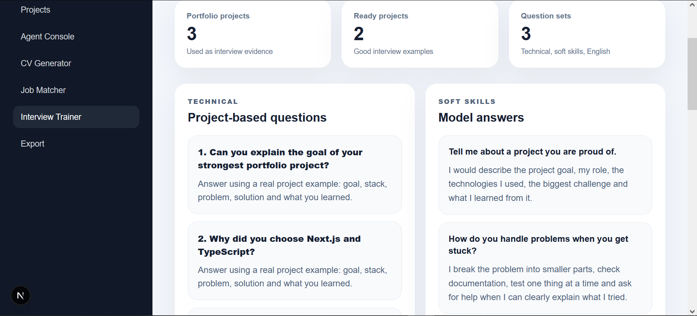
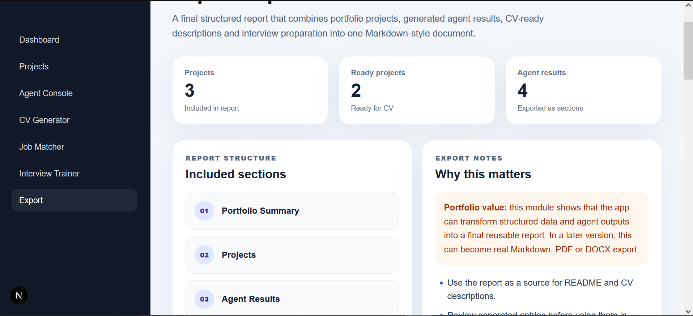

# Career Agent HUD

Career Agent HUD to uporządkowany dashboard do przygotowania kariery, zbudowany w **Next.js**, **React**, **TypeScript** i **CSS Modules**.

Aplikacja pomaga organizować projekty portfolio, generować opisy projektów do CV, porównywać oferty pracy z aktualnymi umiejętnościami, przygotowywać pytania rekrutacyjne oraz tworzyć końcowy raport przygotowania do rekrutacji.

Projekt został przygotowany jako aplikacja portfolio dla osoby aplikującej na pierwszą pracę w IT / frontendzie.

---

## Status projektu

**Wersja:** v0.1 Mock MVP  
**Status:** główne moduły gotowe  
**Build:** przechodzi  
**Lint:** przechodzi

---

## Screeny

Screeny są zapisane w folderze:

```txt
public/screenshots
```

### Dashboard



### Projekty



### Konsola agenta



### Generator CV



### Dopasowanie oferty pracy



### Trener rozmowy kwalifikacyjnej



### Raport eksportu



---

## Główny cel projektu

Głównym celem Career Agent HUD jest wsparcie przygotowania do pierwszej pracy w IT poprzez połączenie zarządzania portfolio z uporządkowanymi workflow w stylu agenta.

Aplikacja pomaga odpowiedzieć na pytania:

- które projekty są gotowe do pokazania w CV,
- jak opisać projekty po polsku i po angielsku,
- które oferty pracy pasują do aktualnych umiejętności,
- jakich umiejętności jeszcze brakuje,
- na jakie pytania warto przygotować się przed rozmową,
- jak zebrać przygotowania w jeden uporządkowany raport.

---

## Główne funkcje

### Dashboard

Dashboard pokazuje ogólny stan przygotowania do rekrutacji.

Zawiera:

- liczbę projektów portfolio,
- liczbę gotowych projektów,
- wynik gotowości,
- ostatnie wyniki mock-agenta,
- szybki dostęp do głównych modułów.

Adres:

```txt
/
```

---

### Projekty

Moduł Projects prezentuje uporządkowane dane projektów portfolio.

Zawiera:

- tytuł projektu,
- opis projektu,
- stack technologiczny,
- funkcje,
- pokazane umiejętności,
- opis do CV po polsku,
- opis do CV po angielsku,
- status projektu.

Adres:

```txt
/projects
```

---

### Agent Console

Agent Console pokazuje kontrolowany workflow mock-agenta.

W wersji v0.1 agent nie jest w pełni autonomiczny. Działa przez zdefiniowane tryby:

- `PROJECT_REVIEW`
- `CV_MODE_PL`
- `CV_MODE_EN`
- `JOB_MATCH`
- `SKILL_GAP`
- `INTERVIEW_MODE`
- `EXPORT_MODE`

Adres:

```txt
/agent
```

---

### CV Generator

CV Generator zamienia uporządkowane dane projektów w opisy gotowe do użycia w CV.

Skupia się na:

- jasnym języku,
- uczciwym opisie doświadczenia,
- opisach przyjaznych rekruterowi,
- wersji polskiej i angielskiej,
- unikaniu przesady i wymyślonych kompetencji.

Adres:

```txt
/cv
```

---

### Job Matcher

Job Matcher porównuje przykładową ofertę pracy z projektami portfolio i aktualnymi umiejętnościami.

Pokazuje:

- wymagane umiejętności,
- mile widziane umiejętności,
- obowiązki z oferty,
- analizę dopasowania,
- rekomendacje,
- projekty, które mogą być dowodem kompetencji.

Adres:

```txt
/jobs
```

---

### Interview Trainer

Interview Trainer pomaga przygotować się do rozmowy kwalifikacyjnej.

Zawiera:

- pytania techniczne oparte na projektach,
- pytania miękkie,
- proste odpowiedzi po angielsku,
- rekomendacje przygotowania.

Adres:

```txt
/interview
```

---

### Export Report

Export Report generuje raport w stylu Markdown.

Łączy:

- podsumowanie portfolio,
- opisy projektów,
- wyniki agenta,
- wpisy do CV,
- przygotowanie do rozmowy,
- następne kroki.

Adres:

```txt
/export
```

---

## Technologie

- **Next.js 16**
- **React**
- **TypeScript**
- **CSS Modules**
- **ESLint 9**
- **Turbopack**
- **mock data**
- **mock agent functions**

---

## Architektura

Projekt jest oparty na typowanych danych i kontrolowanych funkcjach workflow.

Uproszczony przepływ:

```txt
Dane portfolio
  ↓
Typowany model projektu
  ↓
Funkcje mock-agenta
  ↓
Uporządkowany wynik
  ↓
Dashboard / CV / Job Match / Interview / Export
```

---

## Główne typy danych

Projekt używa TypeScriptu do modelowania danych aplikacji.

Główne typy:

- `PortfolioProject`
- `JobOffer`
- `AgentResult`
- `AgentMode`
- `ProjectStatus`

Typy znajdują się w pliku:

```txt
types/career.ts
```

---

## Dane mockowe

Projekty portfolio znajdują się w pliku:

```txt
data/mockProjects.ts
```

Dzięki temu dane są oddzielone od interfejsu, a aplikację łatwiej rozbudować.

---

## Warstwa mock-agenta

Funkcje mock-agenta znajdują się w pliku:

```txt
lib/mockAgent.ts
```

Aktualne funkcje:

- `analyzeProject`
- `generateCvDescriptionPL`
- `generateCvDescriptionEN`
- `matchJobOffer`
- `generateInterviewQuestions`
- `exportCareerReport`

Warstwa mock-agenta jest oddzielona od UI, żeby w przyszłości można było dodać prawdziwą integrację z AI bez przepisywania całego interfejsu.

---

## Aktualne trasy

```txt
/
 /projects
 /agent
 /cv
 /jobs
 /interview
 /export
```

---

## Zasady bezpieczeństwa i uczciwości

Aplikacja jest zaprojektowana wokół uczciwego przygotowania do rekrutacji.

Agent nie powinien:

- wymyślać doświadczenia komercyjnego,
- dodawać technologii, których nie użyto,
- wyolbrzymiać zakresu projektu,
- automatycznie aplikować na oferty,
- ukrywać brakujących umiejętności.

Agent powinien:

- jasno opisywać projekty edukacyjne i portfolio,
- pokazywać realne umiejętności wynikające z projektów,
- pomagać tworzyć uczciwe wpisy do CV,
- wskazywać luki w umiejętnościach,
- wspierać przygotowanie do rozmowy.

---

## Czego nauczyłam się przy tym projekcie

Podczas budowy projektu ćwiczyłam:

- tworzenie wielostronicowej aplikacji w Next.js,
- używanie App Routera,
- pracę z modelami danych w TypeScript,
- oddzielanie danych, logiki i interfejsu,
- tworzenie funkcji mock-agenta,
- budowanie layoutów dashboardowych,
- obsługę błędów ESLint i builda produkcyjnego,
- projektowanie aplikacji gotowej do portfolio,
- myślenie o bezpiecznych workflow wspieranych przez AI.

---

## Komendy developerskie

Instalacja zależności:

```bash
npm install
```

Uruchomienie serwera developerskiego:

```bash
npm run dev
```

Jeśli PowerShell blokuje skrypty npm na Windowsie, użyj:

```bash
npm.cmd run dev
```

Uruchomienie lintowania:

```bash
npm run lint
```

albo:

```bash
npm.cmd run lint
```

Uruchomienie builda produkcyjnego:

```bash
npm run build
```

albo:

```bash
npm.cmd run build
```

---

## Aktualne ograniczenia

Ta wersja używa danych mockowych i funkcji mock-agenta.

Prawdziwa integracja z API AI jest planowana w późniejszej wersji.

---

## Roadmapa

### v0.1 — Mock MVP

Gotowe:

- dashboard,
- strona projektów,
- konsola agenta,
- generator CV,
- job matcher,
- trener rozmowy kwalifikacyjnej,
- raport eksportu,
- typowane dane mockowe,
- funkcje mock-agenta,
- przechodzący ESLint,
- przechodzący build produkcyjny.

---

### v0.2 — Prawdziwa warstwa agenta

Planowane:

- endpoint API dla wywołań agenta,
- integracja z prawdziwym AI,
- uporządkowane odpowiedzi,
- walidacja,
- obsługa błędów,
- stany ładowania,
- świadomość kosztów i tokenów.

---

### v0.3 — Dopracowanie portfolio

Planowane:

- screeny,
- scenariusz demo,
- dokumentacja architektury,
- case study projektu,
- finalne dopracowanie GitHuba,
- szkic posta na LinkedIn.

---

### v0.4 — Funkcje zaawansowane

Możliwe ulepszenia:

- baza danych,
- logowanie użytkownika,
- prawdziwy eksport Markdown,
- eksport PDF,
- porównywanie wielu ofert pracy,
- punktacja umiejętności,
- tryb ćwiczenia mówienia po angielsku,
- długoterminowy plan nauki.

---

## Cel projektu

Projekt został zbudowany jako praktyczna aplikacja portfolio pokazująca frontend development, modelowanie danych w TypeScript, projektowanie dashboardów i myślenie o workflow wspieranych przez AI.

Celem nie jest stworzenie w pełni autonomicznego agenta, tylko pokazanie realistycznego, bezpiecznego i zrozumiałego produktu agentowego do przygotowania kariery.

---

## Autor

Projekt stworzony jako element portfolio na ścieżce do pracy junior IT / frontend developer.
